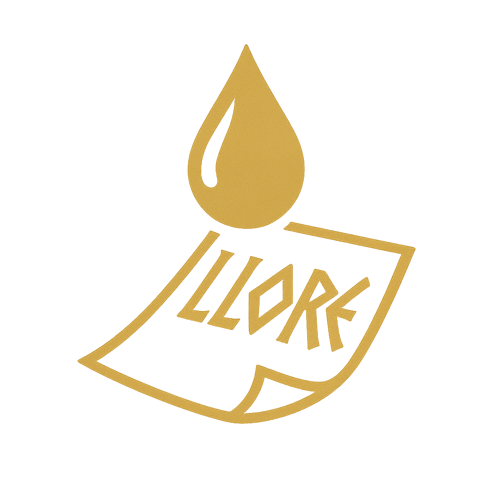
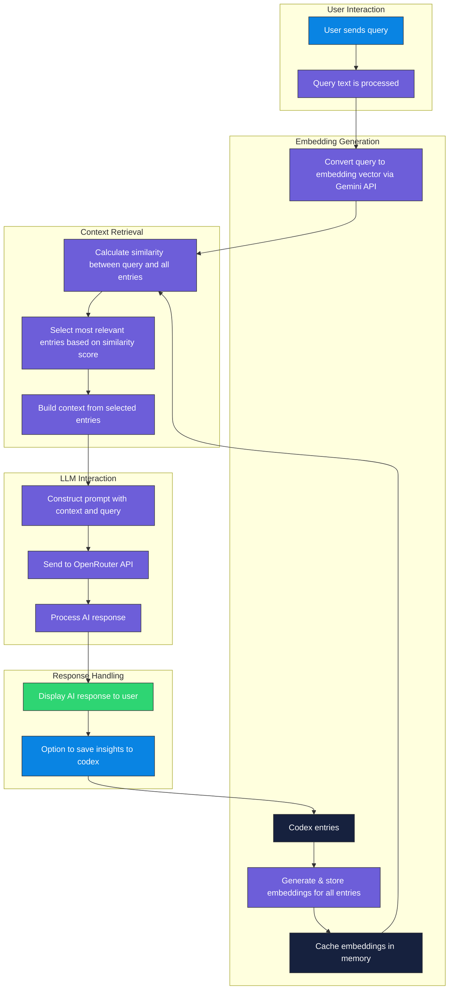

# Llore: Dynamic Codex Management for Fiction Writing



**Llore** is a modern desktop application built with Wails (Go + Web Technologies) to help fiction writers dynamically manage their world-building codex (characters, locations, lore, etc.) with integrated Large Language Model (LLM) assistance. With its sleek interface featuring gradient backgrounds and silver accents, Llore provides a beautiful and intuitive environment for organizing your creative world.

## Table of Contents

-   [Motivation](#motivation)
-   [Core Features](#core-features)
-   [Technology Stack](#technology-stack)
-   [Screenshots (Optional)](#screenshots-optional)
-   [Prerequisites](#prerequisites)
-   [Setup & Installation](#setup--installation)
-   [Configuration](#configuration)
-   [Running Llore](#running-llore)
    -   [Development Mode](#development-mode)
    -   [Building for Production](#building-for-production)
-   [Basic Usage](#basic-usage)
-   [Project Status](#project-status)
-   [Future Work / Roadmap](#future-work--roadmap)
-   [Contributing](#contributing)
-   [License](#license)

## Motivation

Fiction writers often juggle vast amounts of information about their worlds, characters, and plots. Traditional notes or static wiki-like tools can become unwieldy. **Llore** aims to provide a more dynamic and intelligent solution by:

1.  **Leveraging LLMs:** Assisting writers in generating initial ideas, descriptions, or expanding on existing entries.
2.  **Structured Data:** Storing codex entries in a robust database for easy querying and management.
3.  **Cross-Platform:** Using Wails to create a native desktop experience for Windows, macOS, and Linux.
4.  **Context-Aware Generation:** Using Retrieval-Augmented Generation (RAG) with vector embeddings to make LLM responses relevant to the writer's existing codex.
5.  **(Future Goal) Version Control:** Implementing a Git-like system for tracking changes to codex entries, allowing writers to experiment without losing previous versions.

## Core Features

*   **Modern Desktop Experience:**
    *   Beautiful gradient backgrounds and silver accents for a premium feel
    *   Responsive and intuitive interface
    *   Smooth transitions and animations
    *   Cross-platform support via Wails v2

*   **Vault System:**
    *   Create and manage multiple vaults for different projects
    *   Easy vault switching and organization
    *   Secure local storage of your creative content

*   **Codex Entry Management:**
    *   Create and organize entries (Characters, Locations, Items, Lore)
    *   Rich text editing with proper formatting
    *   Quick entry filtering and search
    *   Bulk operations for efficient management

*   **AI Integration:**
    *   OpenRouter API support for access to multiple AI models
    *   Gemini API integration for vector embeddings
    *   Context-aware content generation using RAG
    *   AI-assisted entry creation and enhancement
    *   Customizable model selection

*   **Story Import:**
    *   Import stories and automatically extract relevant entries
    *   Smart parsing of characters, locations, and items
    *   Bulk entry creation from imported content

*   **Library Management:**
    *   Organize and view your story files
    *   Easy access to your creative content
    *   File preview and management

*   **Lore Chat:**
    *   Interactive chat interface for exploring your world
    *   Semantic search for relevant context using embeddings
    *   Context-aware responses based on your codex
    *   Save chat insights directly to your codex

*   **Vector Embeddings System:**
    *   Automatic generation of embeddings for all codex entries
    *   Background processing to maintain application responsiveness
    *   Semantic search capabilities for finding relevant context
    *   Intelligent context selection based on similarity scores

## Technology Stack

*   **Framework:** [Wails v2](https://wails.io/)
*   **Backend Language:** [Go](https://go.dev/)
*   **Frontend Framework:** [Svelte](https://svelte.dev/)
*   **UI:** HTML, CSS, JavaScript/TypeScript
*   **Database:** [SQLite](https://www.sqlite.org/index.html) (via `modernc.org/sqlite`)
*   **LLM Integration:** 
    *   [OpenRouter API](https://openrouter.ai/docs) for access to multiple AI models
    *   [Google Gemini API](https://ai.google.dev/) for generating embeddings
*   **Vector Storage:** SQLite with custom embedding tables

## Screenshots (Optional)

*(Add screenshots of Llore here if available)*
<!--


-->

## Requirements

- **Go** (>=1.20): [Download Go](https://go.dev/dl/)
- **Node.js & npm** (for frontend): [Download Node.js](https://nodejs.org/)
- **Wails CLI**: `go install github.com/wailsapp/wails/v2/cmd/wails@latest`


## Prerequisites

Before you begin, ensure you have the following installed:

1.  **Go:** Version 1.20 or higher ([Installation Guide](https://go.dev/doc/install))
2.  **Node.js & npm:** Required for frontend dependencies ([Installation Guide](https://nodejs.org/))
3.  **Wails CLI v2:** ([Installation Guide](https://wails.io/docs/gettingstarted/installation))
4.  **Git:** For cloning the repository ([Installation Guide](https://git-scm.com/book/en/v2/Getting-Started-Installing-Git))
5.  **Python 3.x:** For icon generation and utilities ([Installation Guide](https://www.python.org/downloads/))
6.  **API Keys:**
    *   OpenRouter API key - [OpenRouter](https://openrouter.ai/)
    *   Gemini API key - [Google AI Studio](https://makersuite.google.com/app/apikey)

## Setup & Installation

1.  **Clone the repository:**
    ```bash
    git clone https://github.com/YOUR_GITHUB_USERNAME/llore.git
    cd llore
    ```


3.  **Install Go dependencies:**
    ```bash
    go mod tidy
    go install github.com/wailsapp/wails/v2/cmd/wails@latest
    ```

3.  **Install frontend dependencies:**
    ```bash
    cd frontend
    npm install
    cd ..
    ```

## Configuration

Configuration is done through the `~/.llore` folder under `config.json`.

The configuration includes:
- OpenRouter API key for LLM access
- Gemini API key for embeddings
- Default model preferences

## Running Llore

### Development Mode

This mode provides hot-reloading for both the Go backend and the frontend.

1.  Navigate to the project root directory (`llore`).
2.  Run the command:
    ```bash
    wails dev
    ```
3.  The Llore application window will appear. Changes to Go files or frontend code will trigger automatic rebuilds and reloads.

### Building for Production

This compiles Llore into a native, self-contained executable for your platform.

1.  Navigate to the project root directory (`llore`).
2.  Run the command:
    ```bash
    wails build
    ```
3.  The executable will be placed in the `build/bin/` directory (e.g., `Llore.exe` on Windows, `Llore` on Linux/macOS).

## How RAG Chat Works in Llore

Llore uses Retrieval-Augmented Generation (RAG) to provide context-aware responses that understand your fictional world:



### Key Components:

1. **Embedding Generation**: When you add or update entries, Llore automatically generates vector embeddings via Gemini API and stores them
2. **Query Processing**: Your question is converted to an embedding vector using the same model
3. **Semantic Search**: The system finds the most relevant entries by calculating similarity between your query and all entries
4. **Context Building**: Selected entries are formatted into a context block that gives the AI relevant information
5. **AI Response**: The query and context are sent to your selected LLM through OpenRouter, resulting in answers informed by your lore
6. **Knowledge Cycle**: New insights can be saved back to your codex, enriching future responses

## Troubleshooting


## Basic Usage

1.  **First Launch:**
    * Start Llore via `wails dev` or the built executable
    * Create or select a vault for your project
    * The main interface will show various modes: Codex, Story Import, Library, Lore Chat, and Settings

2.  **Configure API Keys:**
    * Get your OpenRouter API key from [OpenRouter](https://openrouter.ai/)
    * Get your Gemini API key from [Google AI Studio](https://makersuite.google.com/app/apikey)
    * Configure both in the Settings page of the application

3.  **Managing Entries:**
    * In Codex mode, use the sidebar to view and manage entries
    * Click "+ New Entry" to create a character, location, item, or lore entry
    * Fill in the name, type, and content
    * Use the AI generation button for creative assistance
    * Save your changes
    * Embeddings are automatically generated for all entries

4.  **Importing Stories:**
    * Use Story Import mode to analyze existing writing
    * Select a story file from your computer
    * Review and approve the automatically extracted entries
    * Import them directly into your codex
    * Embeddings are generated automatically for new entries

5.  **Using Lore Chat:**
    * Enter Lore Chat mode for interactive exploration
    * Ask questions about your world and characters
    * The system finds semantically relevant entries using embeddings
    * Get context-aware responses based on your codex
    * Save interesting responses directly to your codex

6.  **Managing Files:**
    * Use Library mode to organize your story files
    * Preview and edit file contents
    * Keep your creative work organized

## Project Status

**Llore** is a fully functional application with a modern, polished interface.

**Implemented Features:**

*   **Core Architecture:**
    * Go backend with Wails v2 integration
    * Svelte frontend with modern UI components
    * SQLite database for efficient data storage
    * Multi-vault support for project organization

*   **User Interface:**
    * Modern gradient and silver styling
    * Responsive and intuitive layout
    * Smooth transitions and animations
    * Dark theme optimized for creative work

*   **AI Integration:**
    * OpenRouter API integration
    * Multiple AI model support
    * Vector embeddings via Gemini API
    * Context-aware content generation
    * Interactive Lore Chat system

*   **Content Management:**
    * Comprehensive CRUD operations for entries
    * Story import and analysis
    * Library file management
    * Bulk operations support
    * Automatic embedding generation

## Future Work / Roadmap

*   [ ] Enhanced AI Features:
    * [x] Vector embeddings for improved context awareness
    * [ ] Local model support via Ollama
    * [ ] Custom AI model fine-tuning options

*   [ ] Advanced Content Management:
    * [ ] Version control for entries
    * [ ] Rich text editor with formatting
    * [ ] Entry linking and relationship mapping
    * [ ] Advanced search and filtering

*   [ ] Collaboration Features:
    * [ ] Multi-user support
    * [ ] Real-time collaboration
    * [ ] Change tracking and history

*   [ ] Data Management:
    * [ ] Cloud backup options
    * [ ] Import/export in multiple formats
    * [ ] Data migration tools

*   [ ] UI Enhancements:
    * [ ] Customizable themes
    * [ ] Visualization tools for world-building
    * [ ] Mobile-responsive design
    * [ ] Accessibility improvements

## Contributing

Contributions to Llore are welcome! If you'd like to contribute, please:

1.  Fork the repository (`https://github.com/YOUR_GITHUB_USERNAME/llore.git`).
2.  Create a new branch (`git checkout -b feature/your-feature-name`).
3.  Make your changes.
4.  Commit your changes (`git commit -am 'Add some feature'`).
5.  Push to the branch (`git push origin feature/your-feature-name`).
6.  Open a Pull Request against the main repository.

Please report bugs or suggest features using the GitHub Issues tab on the main repository.

## License

This project is licensed under the [MIT License](LICENSE) - see the LICENSE file for details.